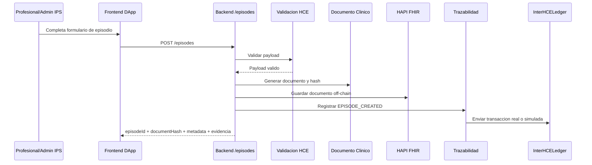
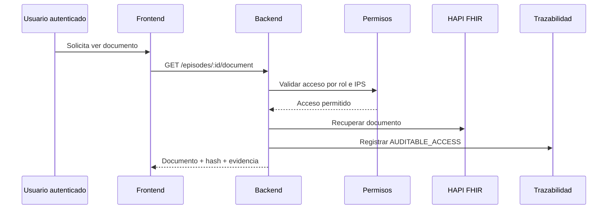
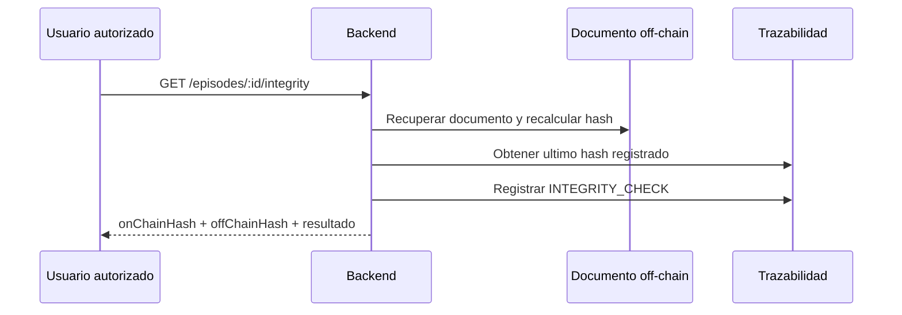

# Arquitectura de InterHCE Ledger

InterHCE Ledger implementa una arquitectura híbrida para interoperabilidad de historias clínicas electrónicas en urgencias. El producto separa los datos clínicos sensibles del registro auditable:

- **Off-chain**: el backend valida, transforma y almacena el documento clínico en HAPI FHIR o en memoria para el prototipo.
- **On-chain**: la blockchain conserva hashes, eventos y metadatos no sensibles para trazabilidad e integridad.

## 1. Vista general

```mermaid
flowchart LR
    U1[Profesional de salud]
    U2[Admin IPS]
    U3[Paciente]
    U4[Auditor]

    subgraph FE[Frontend DApp - React + Vite]
      R1[Login y sesion]
      R2[Portal clinico]
      R3[Gestion de episodios]
      R4[Consulta de trazabilidad]
      R5[Infraestructura]
      R6[Integracion wallet]
    end

    subgraph BE[Backend API - Express + TypeScript]
      B1[/auth]
      B2[/access]
      B3[/episodes]
      B4[/infra]
      S1[Seguridad y autorizacion]
      S2[Validacion HCE]
      S3[Documento clinico]
      S4[Lifecycle de episodio]
      S5[Permisos de acceso]
      S6[Trazabilidad]
      S7[Integracion blockchain real o simulada]
    end

    subgraph FHIR[Servidor clinico off-chain]
      F1[HAPI FHIR]
      F2[Patient / Encounter / Composition / DocumentReference]
    end

    subgraph BC[Blockchain - Ethereum Sepolia]
      C1[Contrato InterHCELedger]
      C2[Eventos on-chain]
      C3[Hashes y metadatos]
    end

    U1 --> FE
    U2 --> FE
    U3 --> FE
    U4 --> FE

    FE --> B1
    FE --> B2
    FE --> B3
    FE --> B4
    FE -. wallet .-> C1

    B1 --> S1
    B2 --> S1
    B2 --> S5
    B3 --> S2
    B3 --> S3
    B3 --> S4
    B3 --> S5
    B3 --> S6
    B4 --> S7

    S3 --> F1
    F1 --> F2

    S6 --> S7
    S7 --> C1
    C1 --> C2
    C1 --> C3
```

## 2. Principio arquitectónico

El sistema sigue un modelo **on-chain / off-chain**:

- El **documento clínico completo** nunca se guarda en blockchain.
- El backend genera un **hash SHA-256 canónico** del documento clínico.
- Ese hash, junto con `episodeId`, `eventId` y metadatos seudonimizados, se registra en trazabilidad.
- La verificación de integridad compara el hash recuperado del documento off-chain frente al último hash registrado en trazabilidad/on-chain.

Esto reduce exposición de datos sensibles y deja evidencia verificable de creación, actualización, permisos y consultas auditables.

## 3. Usuarios y módulos que utilizan

### Roles del sistema

| Rol | Uso principal | Capacidades visibles en el producto |
|---|---|---|
| `profesional_salud` | Registrar y actualizar atención clínica | Crear episodio, actualizar episodio, consultar episodios, ver documento |
| `admin_ips` | Operar episodios y administrar acceso institucional | Todo lo del profesional + gestionar usuarios IPS + gestionar permisos entre IPS |
| `paciente` | Consultar episodios asociados | Consulta de episodios |
| `auditor` | Revisar eventos y evidencias | Consultar trazabilidad; en frontend también puede ver documento |

### Módulos del frontend orientados al usuario

| Módulo | Qué resuelve | Rutas/pantallas asociadas |
|---|---|---|
| Autenticación y sesión | Inicio de sesión, persistencia de token y contexto de rol | `LoginPage`, `SessionContext`, `sessionStorage` |
| Portal clínico | Entrada principal por rol | `PortalClinicoPage` |
| Gestión de episodios | Crear, actualizar, listar y visualizar episodios | `CrearEpisodioPage`, `ActualizarEpisodioPage`, `EpisodiosPage`, `VerEpisodioPage` |
| Consulta de pacientes | Búsqueda funcional para consultar episodios/documentos | `PacientesPage` |
| Trazabilidad | Consulta de integridad, versiones y eventos | `TrazabilidadEpisodioPage` |
| Infraestructura | Estado del backend, blockchain e IPS simuladas | `InfraestructuraPage` |
| Integración blockchain | Conexión de wallet, cambio a Sepolia y envío de trazas | `shared/services/blockchain.ts` |

## 4. Arquitectura del backend

El backend expone una API Express y concentra la lógica de negocio. Está organizado por dominios.

### 4.1 Capa de entrada

| Ruta | Responsabilidad |
|---|---|
| `/auth` | Login, consulta de sesión actual y logout |
| `/access` | Roles, capacidades y administración de usuarios por IPS |
| `/episodes` | Validación, creación, actualización, permisos, documento, integridad y trazabilidad |
| `/infra` | Estado de infraestructura, IPS simuladas y contratos simulados |

### 4.2 Módulos internos del backend

| Módulo | Archivo base | Responsabilidad |
|---|---|---|
| API principal | `backend/src/server.ts` | Inicializa Express, CORS, JSON y Swagger |
| Autenticación | `backend/src/security/autenticacionService.ts` | Gestiona sesiones con token y validación de credenciales |
| Autorización | `backend/src/security/autorizacionService.ts` | Deriva actor desde token o headers y valida permisos por rol |
| Gestión de usuarios | `backend/src/access/accesoUsuariosService.ts` | Usuarios semilla, roles, capacidades y administración por IPS |
| Validación HCE | `backend/src/hce/validationService.ts` | Verifica que el payload cumpla el modelo clínico |
| Documento clínico | `backend/src/hce/documentoClinicoService.ts` | Genera documento canónico, calcula hash y persiste off-chain |
| Lifecycle del episodio | `backend/src/hce/episodioLifecycleService.ts` | Versionado, evento de urgencias y reglas de actualización |
| Permisos de episodio | `backend/src/hce/permisosEpisodioService.ts` | Controla acceso entre IPS y ownership del episodio |
| Trazabilidad | `backend/src/hce/trazabilidadService.ts` | Registra eventos, guarda evidencia y consulta historial |
| Integración FHIR | `backend/src/hce/fhirClient.ts`, `fhirStorageService.ts` | Persistencia y recuperación desde HAPI FHIR |
| Infraestructura blockchain | `backend/src/infra/blockchainTraceService.ts` | Conexión RPC, ABI, contrato y envío real a Sepolia |

## 5. Arquitectura blockchain

La capa blockchain está implementada con el contrato `InterHCELedger.sol`.

### 5.1 Qué guarda el contrato

| Elemento | Descripción |
|---|---|
| `usuarios` | Direcciones con rol, hash de IPS y estado activo |
| `episodios` | `episodeIdHash`, `eventIdHash`, hash documental actual y versión |
| Eventos `EpisodioRegistrado` y `EpisodioActualizado` | Evidencia de creación/actualización |
| Evento `PermisoDocumentoActualizado` | Evidencia de otorgamiento o revocación de acceso |
| Evento `TrazaOperacion` | Trazas auditables generales |
| Evento `TrazaRaw` | Captura payloads enviados al `fallback` |

### 5.2 Qué no guarda

- No almacena el documento clínico.
- No almacena datos personales identificables en texto claro.
- No reemplaza el servidor clínico ni el modelo FHIR.

### 5.3 Modos de operación blockchain

| Modo | Cómo funciona |
|---|---|
| `real` | El backend usa RPC de Sepolia, ABI y dirección desplegada para invocar el contrato |
| `simulado` | Si no hay configuración completa, el sistema genera evidencia local con hash de transacción simulado |

## 6. Servidor clínico off-chain

El backend utiliza `HAPI FHIR` como almacenamiento clínico principal cuando `FHIR_BASE_URL` está configurado.

### Componentes involucrados

| Componente | Función |
|---|---|
| `fhirClient.ts` | Detecta si FHIR está configurado y prepara el acceso |
| `fhirStorageService.ts` | Persiste, recupera, lista y busca episodios en el servidor FHIR |
| `documentoClinicoService.ts` | Construye el documento clínico y calcula el hash verificable |

### Qué se almacena off-chain

- Documento clínico validado del episodio.
- Recursos clínicos interoperables bajo el enfoque HL7 FHIR.
- Información sensible y estructurada necesaria para continuidad asistencial.

## 7. Flujos principales

### 7.1 Registro de episodio



### 7.2 Consulta de documento clínico



### 7.3 Verificación de integridad



## 8. Separación de responsabilidades

| Capa | Responsabilidad |
|---|---|
| Frontend | Experiencia de usuario, captura de datos, sesión, consumo de API y wallet |
| Backend | Reglas de negocio, validación clínica, seguridad, versionado, permisos y orquestación |
| HAPI FHIR | Persistencia del contenido clínico interoperable |
| Blockchain | Evidencia inmutable, integridad y trazabilidad no sensible |

## 9. Decisión arquitectónica clave

La decisión más importante del producto es que **la blockchain no funciona como base de datos clínica**, sino como **capa de evidencia y confianza**. El servidor y FHIR siguen siendo el núcleo operativo del dato clínico; la cadena solo certifica eventos, versiones y hashes.

## 10. Archivos base para profundizar

- `frontend/src/app/router.tsx`
- `frontend/src/shared/services/api.ts`
- `frontend/src/shared/services/blockchain.ts`
- `backend/src/server.ts`
- `backend/src/routes/episodes.ts`
- `backend/src/access/accesoUsuariosService.ts`
- `backend/src/hce/documentoClinicoService.ts`
- `backend/src/hce/trazabilidadService.ts`
- `backend/src/infra/blockchainTraceService.ts`
- `contracts/contracts/InterHCELedger.sol`
