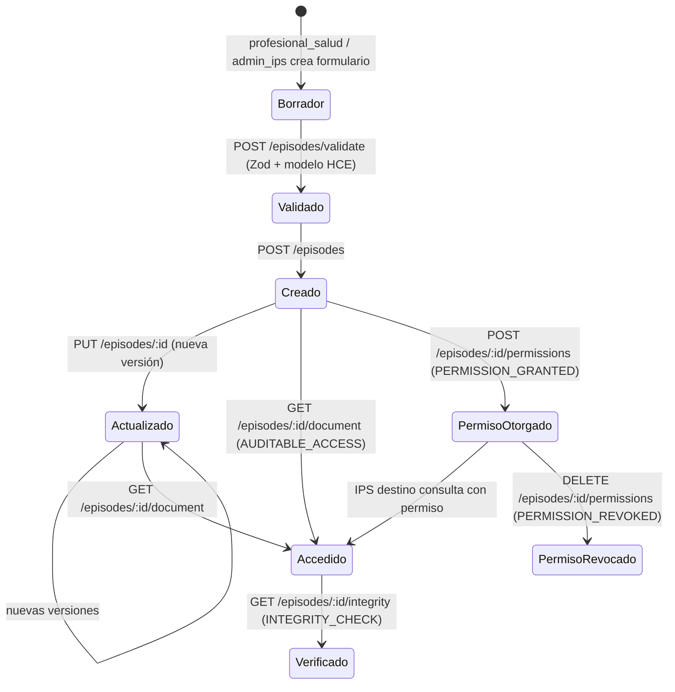
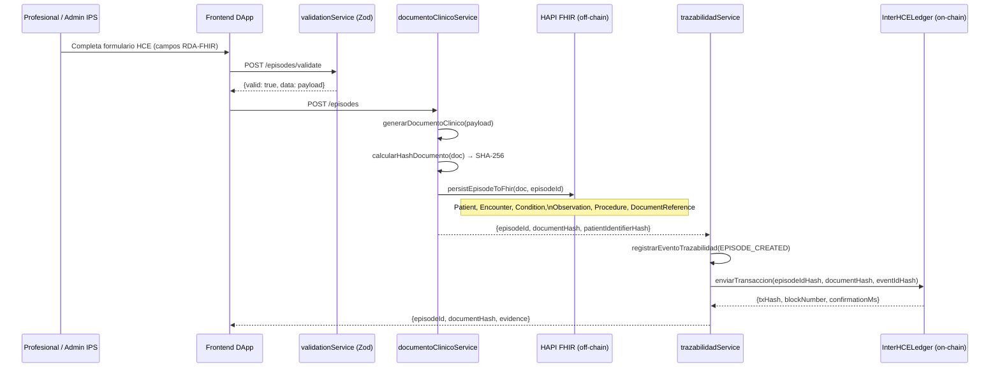
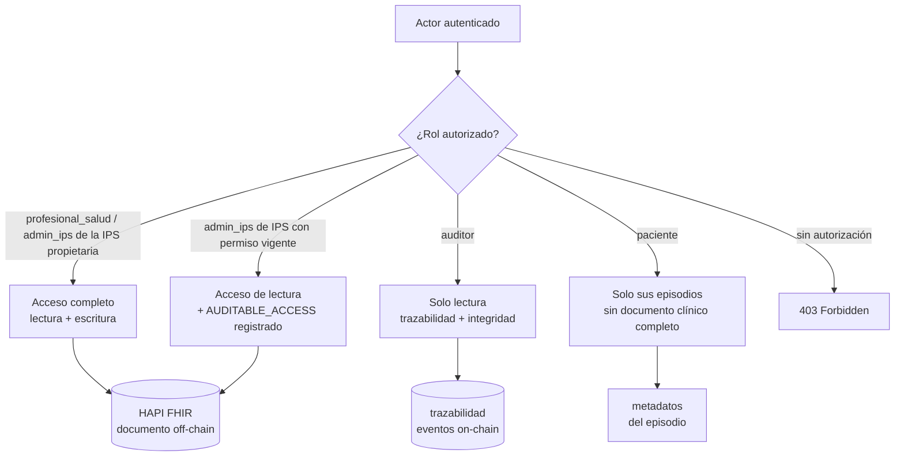
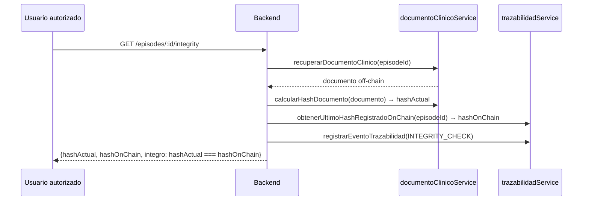

# Arquitectura de la Historia Clínica Electrónica (HCE)

Este documento describe el flujo completo de una HCE en InterHCE Ledger:
creación, cifrado/hashing, almacenamiento on-chain/off-chain, acceso por rol
y verificación de integridad.

---

## 1. Ciclo de vida de un episodio clínico



---

## 2. Flujo detallado: creación de episodio



---

## 3. Almacenamiento on-chain vs. off-chain

| Dato | Dónde se guarda | Por qué |
|---|---|---|
| Documento clínico completo (diagnóstico, medicamentos, signos vitales) | Off-chain — HAPI FHIR / almacén en memoria | Dato sensible, prohibido exponer en blockchain |
| Hash SHA-256 del documento | On-chain — evento `EpisodioRegistrado` | Permite verificar integridad sin exponer el contenido |
| `episodeIdHash` (hash de UUID) | On-chain | Referencia no reversible al episodio |
| `eventIdHash` (hash de UUID del evento) | On-chain | Trazabilidad del evento de urgencias |
| `patientIdentifierHash` (hash del número de documento) | On-chain | Seudonimización; no almacena nombre ni CC en claro |
| Versión del episodio | On-chain | Control de cambios auditable |
| Metadatos FHIR (Patient, Encounter, Condition…) | Off-chain — HAPI FHIR | Estándar HL7 FHIR para interoperabilidad clínica |
| Lifecycle del episodio (versiones, actores) | Off-chain — `backend/data/episodio-lifecycle.json` | Estado operativo; no requiere inmutabilidad blockchain |
| Permisos entre IPS | Off-chain — `backend/data/episodio-permisos.json` + on-chain evento | Estado en JSON + evidencia en contrato |

---

## 4. Acceso por rol



---

## 5. Verificación de integridad



La verificación compara el hash SHA-256 calculado en tiempo real del documento
off-chain frente al último hash registrado en trazabilidad (on-chain en modo real,
local en modo mock).

---

## 6. Modelo de datos HCE (estructura FHIR-like)

El episodio sigue el mapeo `RDA-FHIR` definido en `docs/modelo-hce/`.

```
EpisodioFhirLikeInput
├── patient          (Patient FHIR)
│   ├── identifier   (CC u otro tipo de documento)
│   ├── name, birthDate, gender
│   └── extension    (nationality, genderIdentity, ethnicity, disability, occupation)
├── cobertura        (Coverage FHIR — EPS/aseguradora)
├── encuentro        (Encounter FHIR)
│   ├── class        (urgencias)
│   ├── period       (inicio/fin de atención)
│   ├── extension    (vía de ingreso, hora de triage)
│   └── reasonCode   (motivo de consulta RDA)
├── condiciones[]    (Condition FHIR — diagnósticos CIE-10)
├── observaciones[]  (Observation FHIR — signos vitales, scores)
├── procedimientos[] (Procedure FHIR — intervenciones)
└── prestadorOrigen  (Organization FHIR — IPS que registra)
```

Validación ejecutada por `hceValidationSchema.ts` (Zod) en `POST /episodes/validate`.

---

## 7. Archivos clave

| Propósito | Archivo |
|---|---|
| Modelo de datos HCE | `backend/src/hce/hceModel.ts` |
| Validación Zod | `backend/src/hce/hceValidationSchema.ts` |
| Generación y hash del documento | `backend/src/hce/documentoClinicoService.ts` |
| Persistencia FHIR | `backend/src/hce/fhirStorageService.ts` |
| Lifecycle y versiones | `backend/src/hce/episodioLifecycleService.ts` |
| Permisos entre IPS | `backend/src/hce/permisosEpisodioService.ts` |
| Trazabilidad y hash on-chain | `backend/src/hce/trazabilidadService.ts` |
| Contrato on-chain | `contracts/contracts/InterHCELedger.sol` |
