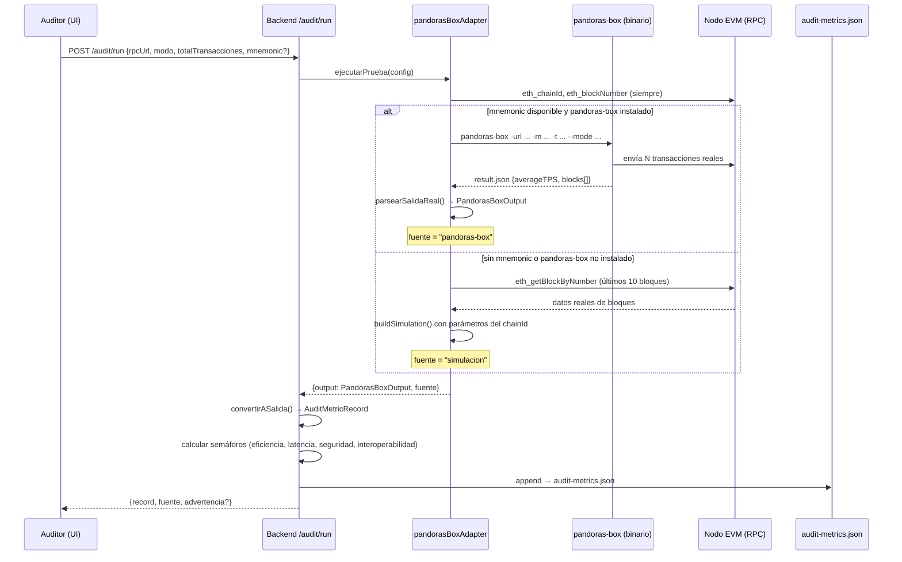
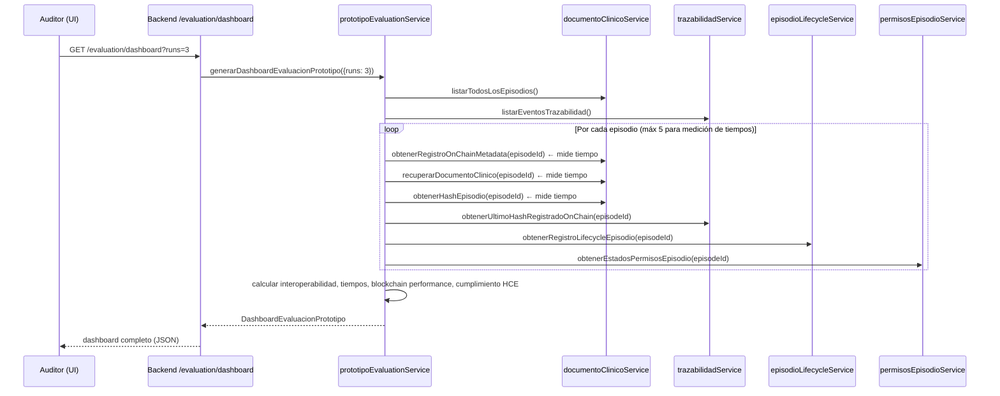
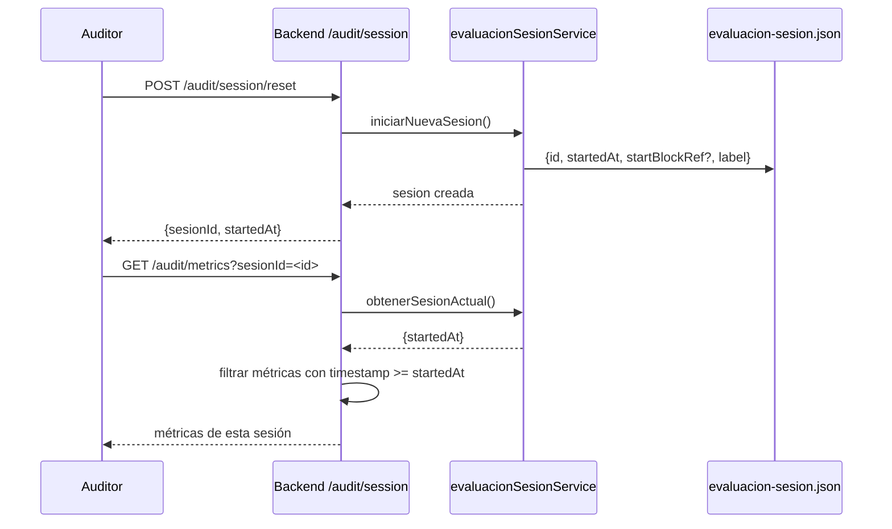
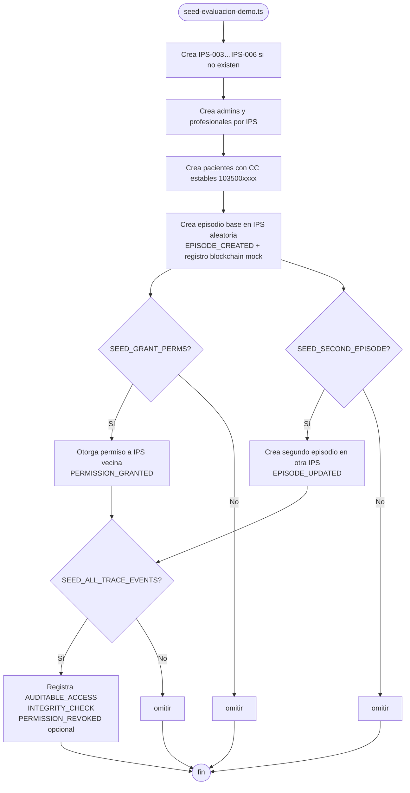

# Arquitectura del módulo de evaluación y pruebas

Este documento describe cómo funciona el módulo de evaluación de desempeño
(RF10) de InterHCE Ledger: pandoras-box, recolección de métricas, persistencia
y visualización en el dashboard del auditor.

---

## 1. Visión general del módulo de evaluación

El módulo tiene dos subsistemas independientes:

| Subsistema | Qué mide | Endpoint |
|---|---|---|
| **Sección A — Pruebas de estrés de red** | Rendimiento de la red blockchain: TPS, latencia de confirmación, gas, tasa de éxito | `POST /audit/run`, `GET /audit/metrics` |
| **Sección B — Evaluación de interoperabilidad clínica** | Cómo la DApp gestiona episodios entre múltiples IPS: continuidad, integridad, tiempos de acceso | `GET /evaluation/dashboard` |

---

## 2. Flujo de una prueba de estrés (Sección A)



---

## 3. Lógica de semáforos

| Semáforo | Verde | Amarillo | Rojo |
|---|---|---|---|
| **Eficiencia (TPS)** | TPS promedio ≥ 10 | ≥ 5 | < 5 |
| **Latencia** | ≤ 15 000 ms (~1 bloque EVM) | ≤ 30 000 ms (~2 bloques) | > 30 000 ms |
| **Seguridad** | tasa de éxito ≥ 95 % | ≥ 80 % | < 80 % |
| **Interoperabilidad** | nodo accesible + contrato activo + lecturas/escrituras OK | nodo accesible, sin contrato (EOA) o llamadas ERC < 95 % | nodo no responde o deploy fallido |

Los umbrales de latencia se fijaron en 15 s/30 s porque Ethereum/Sepolia (PoS)
tiene un block time de ≈ 12 s.  Un valor de "verde" de 3 s sería inalcanzable
en cualquier red EVM real, generando falsos negativos permanentes.

---

## 4. Flujo de evaluación de interoperabilidad clínica (Sección B)



---

## 5. Estructura del dashboard de evaluación

```
DashboardEvaluacionPrototipo
├── overview              — totales: episodios, trazas, IPS, modo blockchain
├── interoperability      — escenarios multi-IPS, continuidad, permisos
│   └── scenarios[]       — detalle por episodio: IPS involucradas, integridad, consistencia
├── timings               — tiempos medidos (N runs × M episodios)
│   └── operations
│       ├── metadataOnChain      — lectura de trazabilidad / contrato
│       ├── documentOffChain     — recuperación desde FHIR
│       └── integrityVerification — cálculo hash + comparación
├── blockchainPerformance — operaciones por tipo (EPISODE_CREATED, etc.), gas, costo
├── audit                 — eventos de trazabilidad, actores, episodios íntegros
└── compliance            — cumplimiento HCE (RF8, RF9, RF10, RF11), limitaciones
```

---

## 6. Sesiones de evaluación

Para aislar métricas entre sesiones de prueba sin borrar el historial completo,
el sistema soporta **snapshots de sesión**:



---

## 7. Script de población de datos demo

`backend/scripts/seed-evaluacion-demo.ts` genera datos sintéticos para poblar
el sistema antes de ejecutar la evaluación:



### Variables de entorno del script

| Variable | Default | Descripción |
|---|---|---|
| `SEED_NUM_PATIENTS` | `18` | Número de pacientes a crear |
| `SEED_SECOND_EPISODE` | `1` | `0` desactiva segundo episodio |
| `SEED_GRANT_PERMS` | `1` | `0` omite permisos cruzados |
| `SEED_ALL_TRACE_EVENTS` | `1` | `0` omite trazas adicionales |
| `SEED_DOCUMENT_OFFSET` | `0` | Offset para CC de pacientes (evita colisiones entre laboratorios) |
| `BLOCKCHAIN_TRACE_MODE` | — | `mock` para no requerir nodo real |

---

## 8. Persistencia de métricas

| Archivo | Contenido | Servicio |
|---|---|---|
| `backend/data/audit-metrics.json` | Historial de evaluaciones de estrés | `auditMetricsService.ts` |
| `backend/data/evaluacion-sesion.json` | Sesiones de evaluación activas (snapshots) | `evaluacionSesionService.ts` |
| `backend/data/episodio-trazabilidad.json` | Eventos de trazabilidad por episodio | `trazabilidadService.ts` |
| `backend/data/episodio-lifecycle.json` | Versiones y lifecycle de episodios | `episodioLifecycleService.ts` |
| `backend/data/episodio-permisos.json` | Permisos entre IPS | `permisosEpisodioService.ts` |

---

## 9. Archivos clave del módulo de evaluación

| Propósito | Archivo |
|---|---|
| Adaptador pandoras-box / simulación | `backend/src/audit/pandorasBoxAdapter.ts` |
| Modelo de datos de auditoría | `backend/src/audit/auditMetricModel.ts` |
| Servicio de métricas y semáforos | `backend/src/audit/auditMetricsService.ts` |
| Servicio de sesiones de evaluación | `backend/src/audit/evaluacionSesionService.ts` |
| Dashboard de interoperabilidad clínica | `backend/src/evaluation/prototipoEvaluationService.ts` |
| Rutas REST de auditoría | `backend/src/routes/audit.ts` |
| Rutas REST de evaluación | `backend/src/routes/evaluation.ts` |
| Vista auditor — Sección A y B | `frontend/src/pages/AuditoriaDashboardPage.tsx` |
| Vista evaluación prototipo | `frontend/src/pages/EvaluacionPrototipoPage.tsx` |
| Script de datos demo | `backend/scripts/seed-evaluacion-demo.ts` |
| Script de reset de datos | `backend/scripts/reset-demo-data.ts` |
